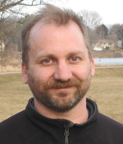

wxie2017 is a free software believer who is trying to be a freelancer working only with free software.
[github](https://github.com/wxie2017) 

---

<h4>contact</h4>

    

        

            wxie2017 
            <a href="https://savannah.gnu.org/projects/www-zh-cn/">GNU CTT</a> 
              

            

            Email: <code>w</code><b>I</b><code>xie</code><b>don't</b><code>@</code><b>want</b><code></code><b>spam!
            </b><code></code><b>So</b><code></code><b>please</b><code>mem</code><b>leave
            </b><code>ber</code><b>me</b><code>.</code><b>alone</b><code>fsf</code><b>!</b><code>.org</code> 
            Phone: none
            

        

        

        
        

    

