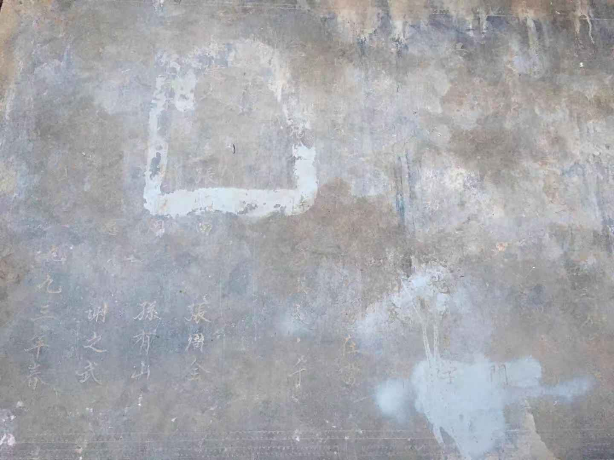

* 记录中国所有消失的学校

** 引言

2020 年 12 月 12 日，河大上海校友会物理分会微信群内有人（09电子_步增）晒出
一张图片。



很多学校已经消失了！这就使我萌生了一个记录中国所有消失的学校的想法。

** 需要做的事情

记录事情最简单直接的方法就是创建网站。创建网站最简单的方法就是在 [gitlab](www.gitlab.com)
上创建静态网站。步骤如下：

1. Create a new project

The project is [Schools disappeared in China](https://gitlab.com/schools-disappeared-in-china/webpages) .
It is a public project so that everyone can modify it in good will.

2. Add the configuration file (.gitlab-ci.yml)

We the following `.gitlab-ci.yml` file from [org-mode web](https://gitlab.com/pages/org-mode) .

```
image: iquiw/alpine-emacs

.build: &build
  script:
  - emacs --batch --no-init-file --load publish.el --funcall org-publish-all
  artifacts:
    paths:
    - public

pages:
  <<: *build
  only:
  - master

test:
  <<: *build
  except:
  - master
```

3. Upload your website content

The initial website content is also from [org-mode publish site](https://gitlab.com/pages/org-mode) .

4. Add your custom domain (optional)

The domain name right now is [Schools disappeared in China](https://schools-disappeared-in-china.gitlab.io/webpages/) .
We would later choose a .org name for this site if possible.

5. Done!

** 下面就是大家努力宣传，让更多的学生能够把自己对逝去的母校的记忆留到这里。

** 软件版权使用 [GPL v3 or any later version](https://www.gnu.org/licenses/gpl-3.0.txt)，其他使用 [Creative Commons Attribution-NoDerivatives 4.0 International License](http://creativecommons.org/licenses/by-nd/4.0/)。